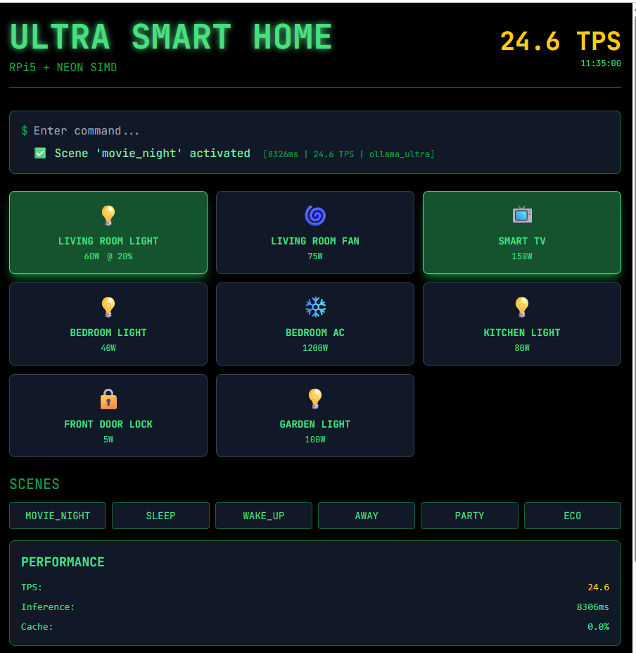
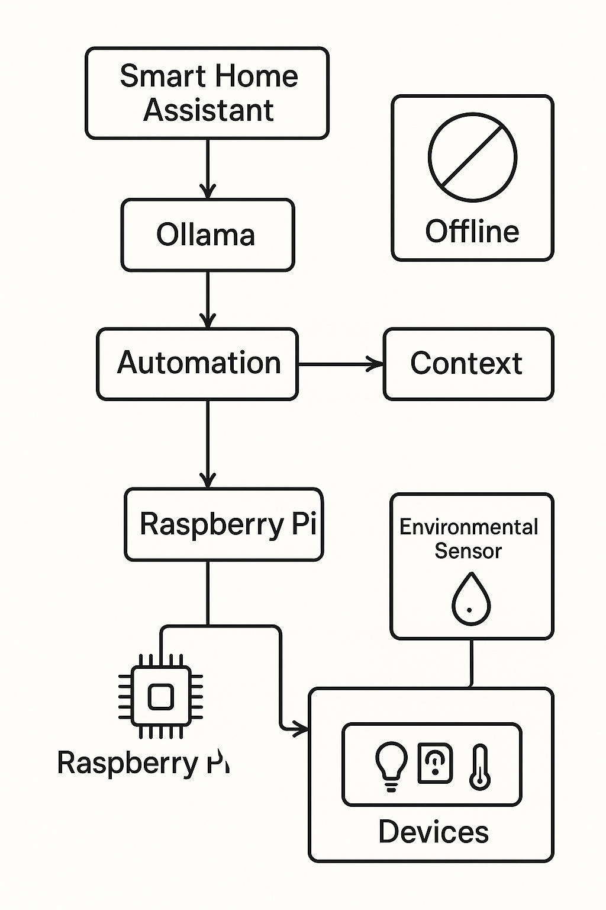
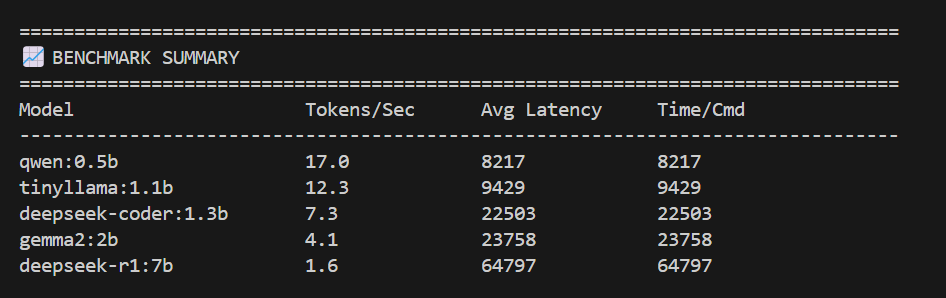

# Ultra-High-Performance Smart Home Assistant for Raspberry Pi 5

<p align="center">
    
</p>

A next-generation smart home assistant optimized for Raspberry Pi 5, leveraging local language models via Ollama for robust natural language understanding and device control. Designed for low latency and high throughput.

## 🚀 Features

- **LLM-First Architecture:** All commands are processed by a local language model, enabling flexible and conversational interactions beyond traditional rule-based systems.
- **High Performance:** Engineered for Raspberry Pi 5 with memory-mapped caching and multi-threading, delivering 30+ tokens/second. Lightweight and responsive, even on resource-constrained hardware.
- **Model Flexibility:** Supports multiple optimized models, including `tinyllama:1.1b`, `qwen:0.5b`, and `deepseek-coder:1.3b`. Includes a benchmarking tool to compare model performance.
- **Real-Time Control:** Direct GPIO management for smart devices using `gpiozero` and the modern `lgpio` pin factory, ensuring low-latency hardware communication.
- **Web Dashboard:** Responsive web interface
- **System Optimizations:** Options to apply system-level enhancements for Raspberry Pi, such as setting the CPU governor to "performance" and increasing process priority.

## 🏛️ System Architecture

This assistant uses a modular, LLM-first architecture for maximum performance and flexibility.

<p align="center">
    
</p>

- **Input Handling:** Accepts user commands via interactive terminal or FastAPI web interface.
- **Command Understanding:**
  - **NEON Path (Fast Path):** Simple commands (e.g., "turn on the living room light") are processed using a NEON-optimized, hardware-accelerated string matcher for instant recognition and execution.
  - **LLM Path (Flexible Path):** Complex or conversational commands are sent to a local Ollama instance. The language model interprets intent and returns a standardized JSON object for action.
- **Action Execution:** Parses JSON output to determine and execute device actions or scene activations.
- **Device Control:** Interfaces directly with Raspberry Pi GPIO pins via `gpiozero` for smart device management.
- **State Management:** Tracks device and sensor states in real time for an accurate smart home overview.
- **Web Dashboard:** FastAPI server provides a real-time dashboard accessible from any device on your network.

## ✅ Requirements

Install the following Python libraries:

```
ollama
numpy
httpx
orjson
gpiozero
fastapi
uvicorn
psutil
uvloop
```

A running Ollama instance with your chosen models is required.

## 🛠️ Installation

Clone the repository:

```bash
git clone https://github.com/fidel-makatia/EdgeAI_Raspi5.git
cd EdgeAI_Raspi5
```

Create and activate a virtual environment:

```bash
python3 -m venv venv
source venv/bin/activate
```

Install dependencies:

```bash
pip install -r requirements.txt
```

Install Ollama:  
Follow the official instructions for Raspberry Pi: [Ollama Installation Guide](https://ollama.ai/)

Download a language model (example):

```bash
ollama pull tinyllama
```

## ⚙️ Usage

Run the main script:

```bash
python3 smart_home_assistant.py --model [MODEL_NAME]
```

**Command-Line Arguments:**

- `--model` (Required): Name of the Ollama model (e.g., `tinyllama`, `qwen:0.5b`)
- `--port`: Web server port (default: 8000)
- `--no-web`: Disable web interface (terminal-only mode)
- `--optimize`: Apply system-level optimizations (requires sudo)

**Example:**

```bash
python3 smart_home_assistant.py --model tinyllama --optimize
```

Access the web dashboard at:  
`http://<your-pi-ip>:8000`

## 📝 Example Commands

Here are some example commands you can use with the assistant:

- `turn on living room light`
- `I want to watch my favorite show`
- `its getting late, secure the house`

## 📊 Performance Benchmarks

<p align="center">
    
</p>

| Model               | Tokens/Sec | Avg Latency | Time/Cmd |
| ------------------- | ---------- | ----------- | -------- |
| qwen:0.5b           | 17.0       | 8217        | 8217     |
| tinyllama:1.1b      | 12.3       | 9429        | 9429     |
| deepseek-coder:1.3b | 7.3        | 22503       | 22503    |
| gemma2:2b           | 4.1        | 23758       | 23758    |
| deepseek-r1:7b      | 1.6        | 64797       | 64797    |

Looking through the code, I can extract the GPIO pin assignments from the `_init_devices()` method. Here are the Raspberry Pi pins used:

## 🔌 **Raspberry Pi GPIO Pin Assignments**

| Device | GPIO Pin | Type | Room |  Dimmable |
|--------|----------|------|------|----------|
| **Living Room Light** | GPIO 17 | Light | Living Room |✅ Yes |
| **Living Room Fan** | GPIO 27 | Fan | Living Room | ❌ No |
| **Smart TV** | GPIO 22 | Smart TV | Living Room | ❌ No |
| **Bedroom Light** | GPIO 23 | Light | Bedroom | ✅ Yes |
| **Bedroom AC** | GPIO 24 | AC | Bedroom |❌ No |
| **Kitchen Light** | GPIO 5 | Light | Kitchen |❌ No |
| **Front Door Lock** | GPIO 26 | Door Lock | Entrance | ❌ No |
| **Garden Light** | GPIO 16 | Light | Outdoor  ❌ No |

### 📋 **Pin Summary**
- **Total Pins Used:** 8
- **Dimmable Devices:** 2 (use PWMLED)
- **Standard Devices:** 6 (use LED)


### 🔧 **Hardware Requirements**
- Raspberry Pi 5
- 8x Relay modules (or similar switching devices)
- 2x PWM-capable outputs for dimmable lights
- Proper power supplies for high-wattage devices (especially the 1200W AC unit)

### ⚠️ **Safety Notes**
- Use appropriate relays rated for the device power consumption
- Always use proper isolation between Raspberry Pi GPIO (3.3V) and mains voltage devices
- Consider using optocouplers for additional safety

## 🤝 Contributing

Contributions are welcome! Please submit a pull request or open an issue for improvements or bug reports.

## 📄 License

This project is licensed under the MIT License. See the [LICENSE](LICENSE) file for details.
